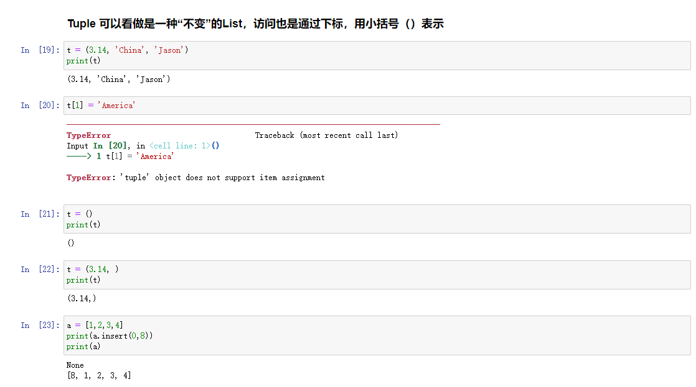
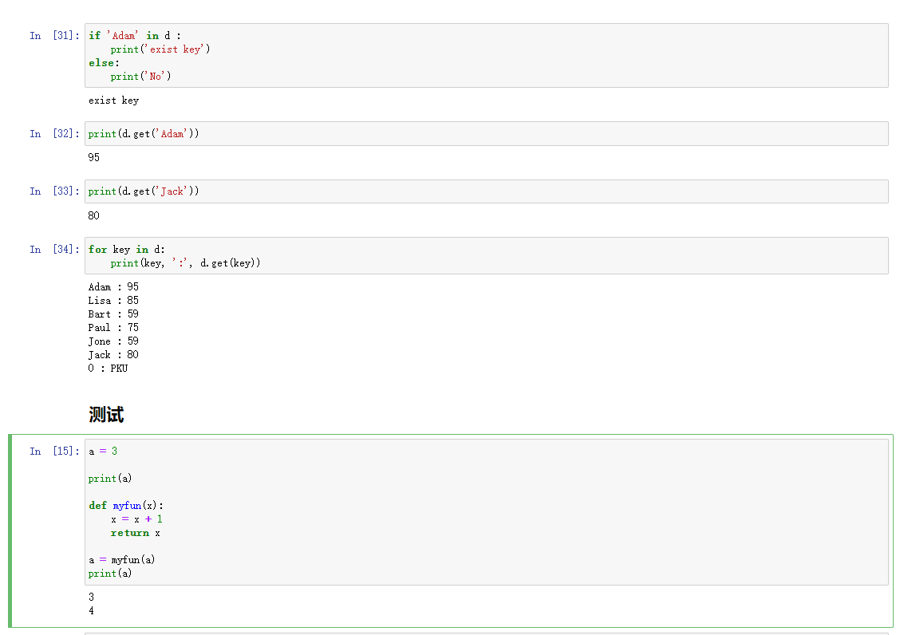
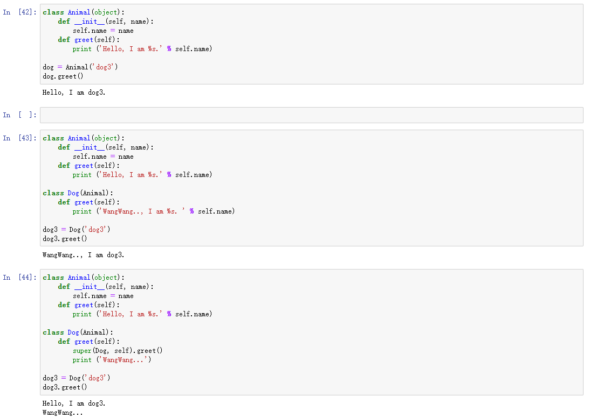
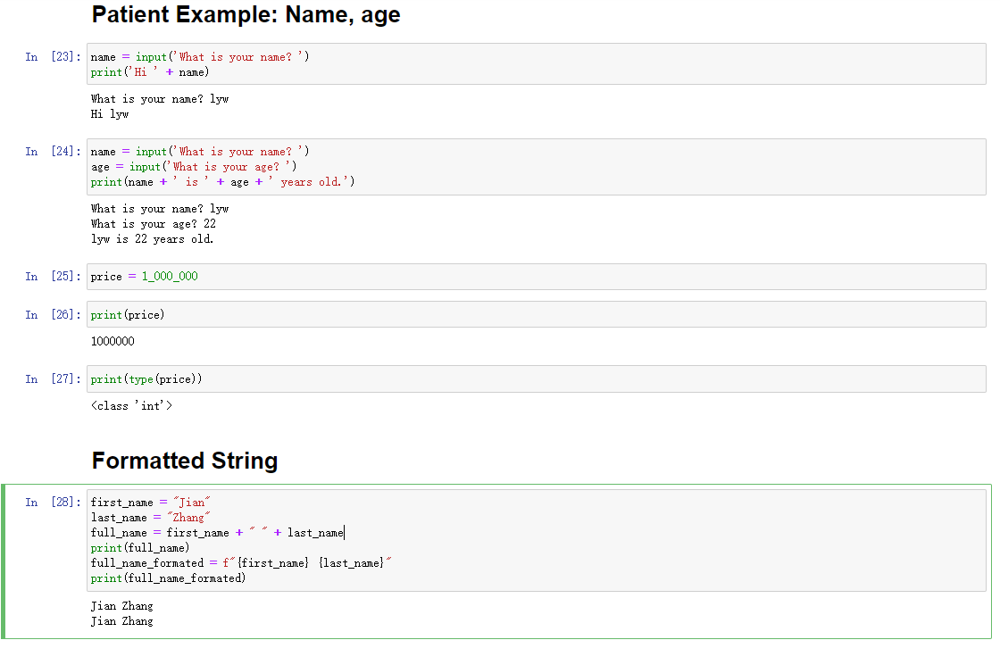
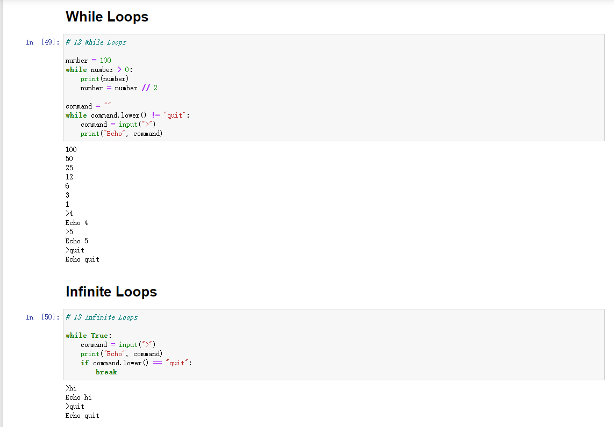
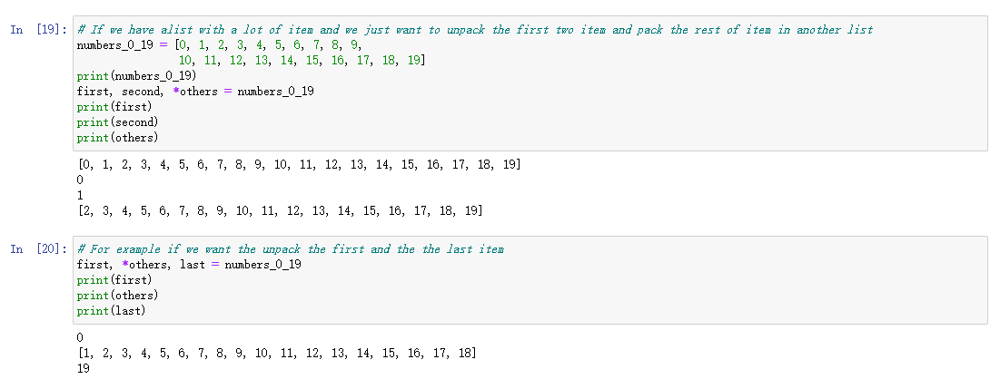
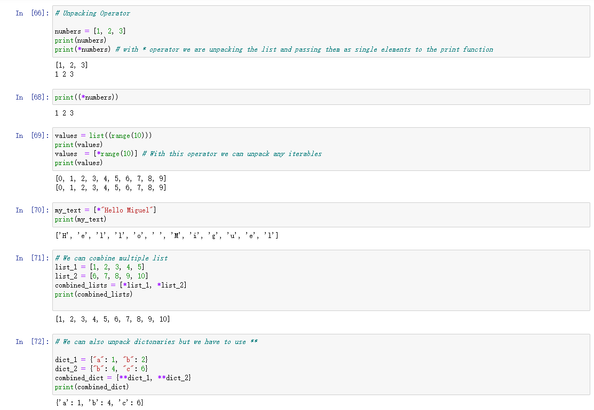
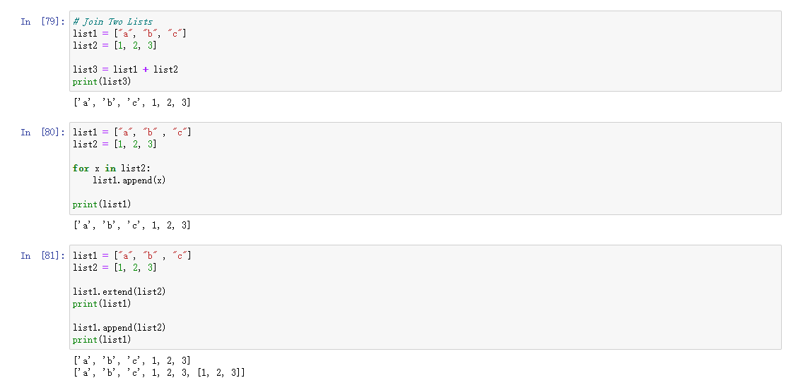
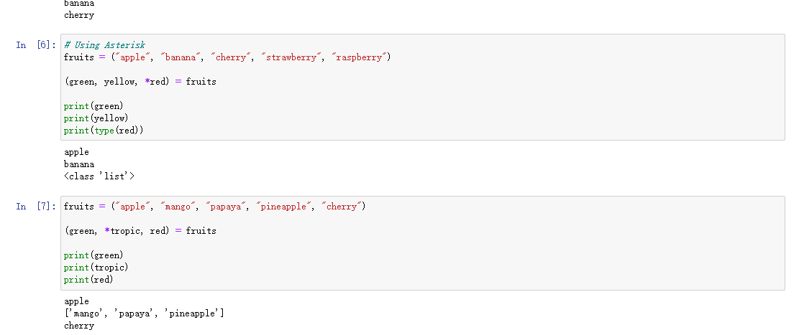

# Homework01
  ## 1. Python00 Example:
* **e.g. Tuple**
   
* **e.g. Dict**
   
* **e.g. Inheritance**
   

   ---

   ## 2. Python01 Example
* **e.g. Input & Format** 
  
* **e.g. Loop**
  

---

## 3. Python02 Example
* **e.g Asterisk Operator**
  
  
---

## 3. Python03 Example
* **e.g. append & extend**
    
* **e.g. Asterisk**
    

Noted: 不要将关键字作为变量名，否则会失效：指向了其他地址