# Homework02
1. Install Opencv, Numpy, Matplotlib package through Bash
```bash
    pip install Pillow
    pip install numpy
    pip install opencv-python
```
2. Run Numpy.ipynb through vscode
* **e.g. Vectorization**
    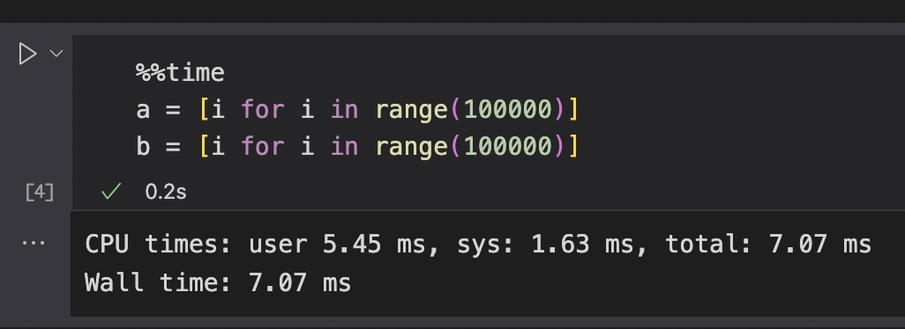
    
* **e.g. check dim**
    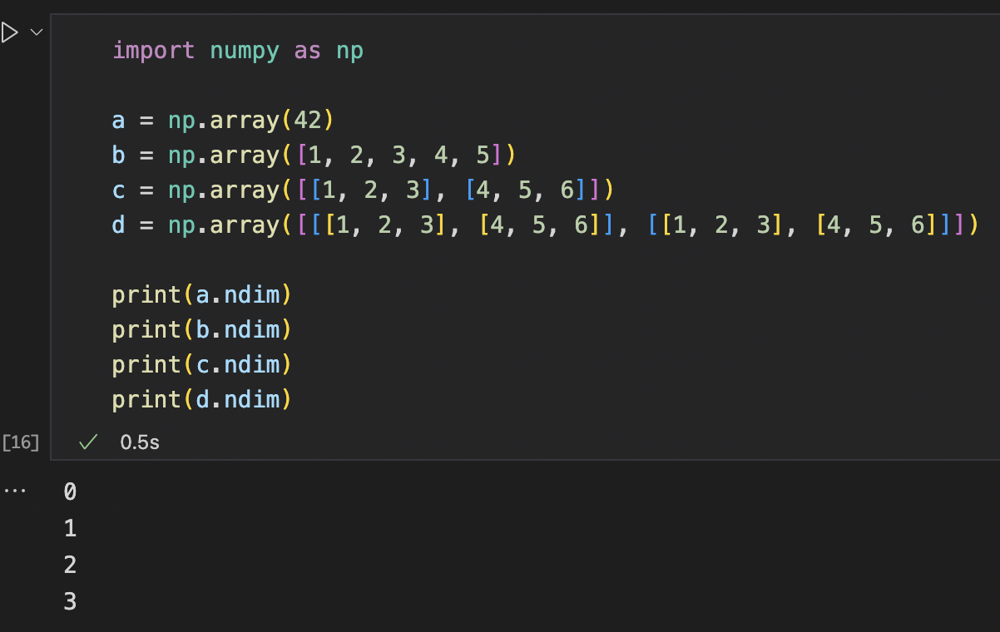
* **e.g. np copy vs view and check**

    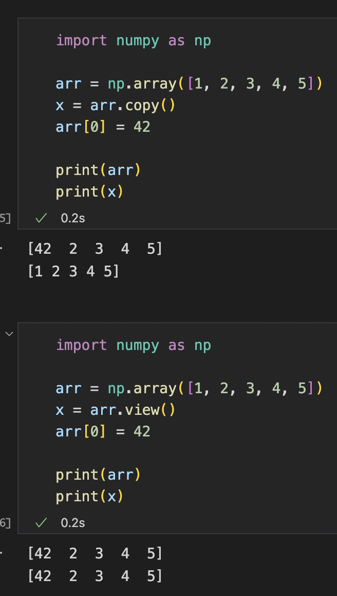
    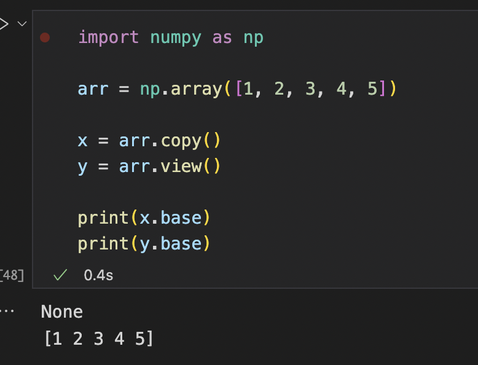
    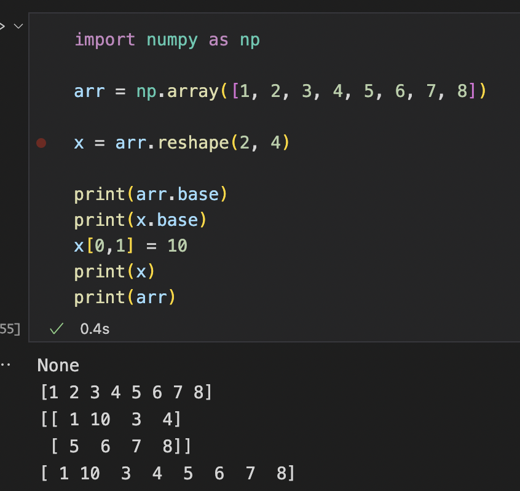
* **e.g. concat and stack**
    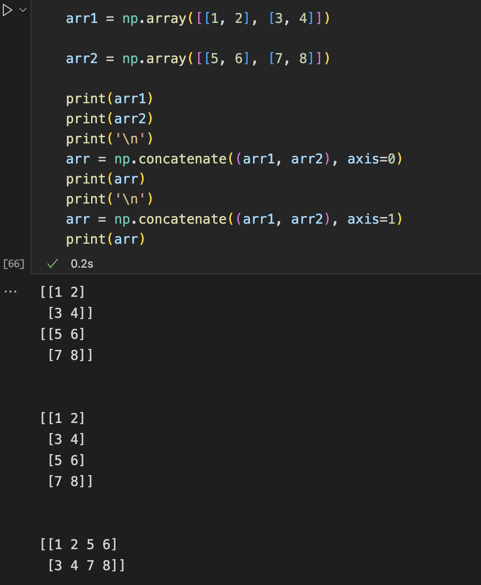
    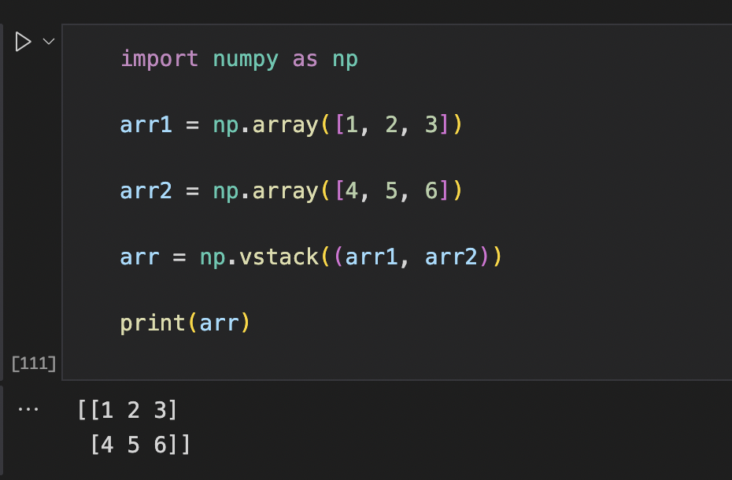
* **e.g. splitting**
    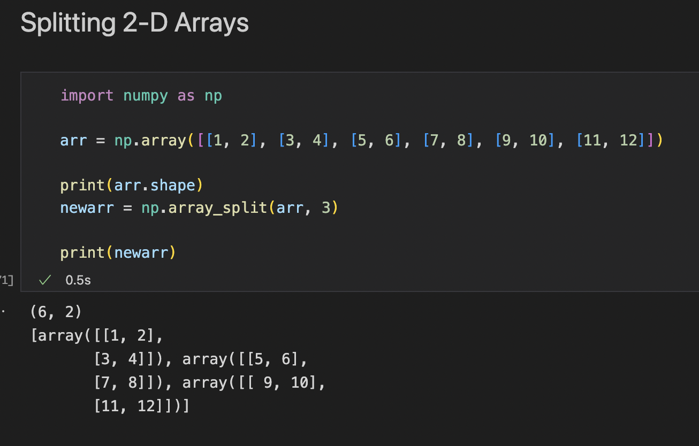
* **e.g. searching**
    
* **e.g. filting**
    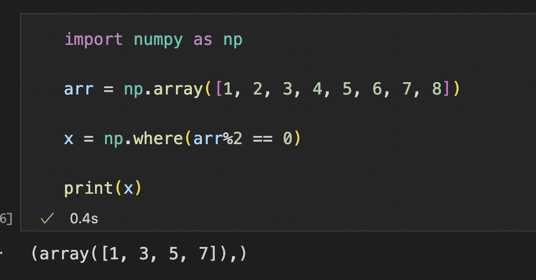

3. Run OpenCV.ipynb through Jupyter
* **e.g. cv2_crop**
    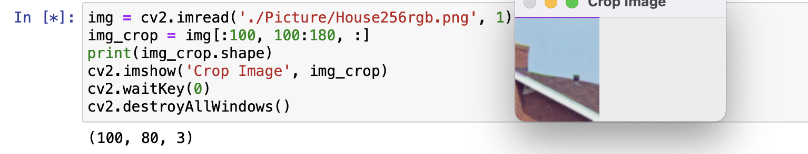
* **e.g. cv2_plot_rec**
    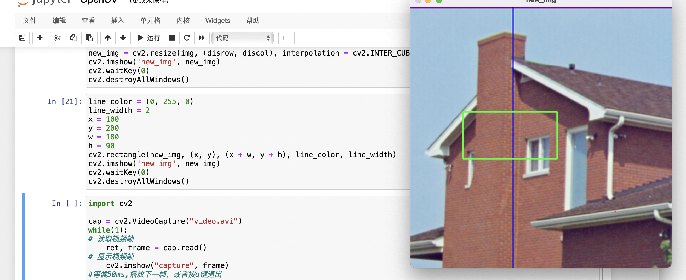

4. Using cv2 to detect the human face
    ```python
    import cv2
    # 加载级联分类器XML文件
    cascade = cv2.CascadeClassifier('haarcascade_frontalface_default.xml') 
    
    img = cv2.imread("./Lena.png") 
    
    img_gray = cv2.cvtColor(img, cv2.COLOR_BGR2GRAY)

    # detectMultiScale(img_grey, scaleFactor, minNeighbors)
    faces = cascade.detectMultiScale(img_gray, 1.5, 5) 

    # plot rectangle, (x,y): upper-left coordinates
    for (x,y,w,h) in faces: 
        cv2.rectangle(img,(x,y),(x+w,y+h),(255,255,0),2) 

        
    cv2.imshow('img',img) 
    cv2.waitKey(0)

    cv2.imwrite("Detect_Lena.png", img)
    cv2.destroyAllWindows() 
    ```
    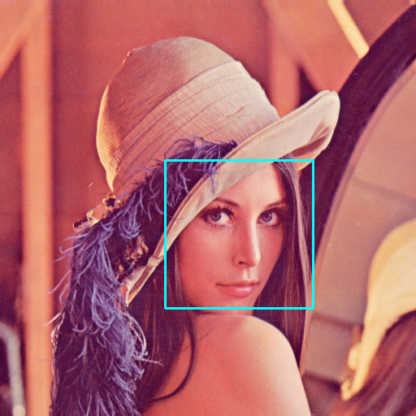
